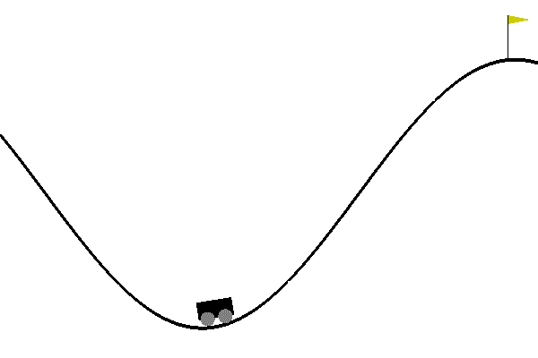

# DQN-Reinforcement-Learning

 DQN is the first deep learning model to successfully learn control policies directly from high-dimensional sensory input using reinforcement learning.
 The model is a convolutional neural network, trained with a variant of Q-learning,
whose input is raw pixels and whose output is a value function estimating future
rewards. They apply DQN to seven Atari 2600 games from the Arcade Learning Environment, with no adjustment of the architecture or learning algorithm. DQN outperform all the previous approches.

<h4> Paper Linke </h4>
<a href="cs.toronto.edu/~vmnih/docs/dqn.pdf"> Playing Atari with Deep Reinforcement Learning </a>
<h4>Installation.</h4>
<ul> <li> Python==3.6.6</li> <li>
Pytorch==1.6.0</li></ul>
<h4> Game Environment.</h4>

 The game environment used is <b><a href="https://gym.openai.com/envs/MountainCar-v0/"> MountainCar-v0</a></b> with discreate action.

<h4> Network Architecture</h4>

 Basic Network is used which consist of fully dense layer with activation function of relu and output layer with linear activation

  <pre> <code> 
    def __init__(self, in_features, out_action):
        super(policyNetwork, self).__init__()
        self.dense =  nn.Linear(in_features = in_features, out_features = 512 )
        self.dense2 = nn.Linear(in_features= 512, out_features=64)
        self.output = nn.Linear(in_features =64, out_features=out_action)
    def forward(self, x):
        x = torch.relu(self.dense(x))
        x = torch.relu(self.dense2(x))
        output = self.output(x)
        return output

</code> </pre>
<h4> Result. </h4> 

